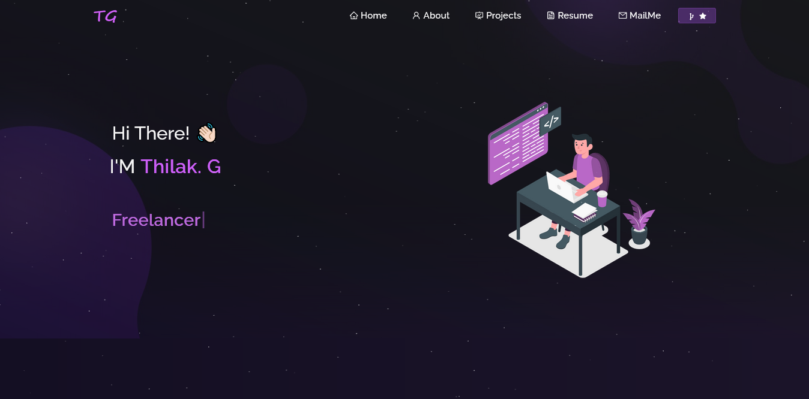

<h1 align="center">
  Personal Portfolio Website 
</h1>

 

My Personal [Portfolio](https://tilakg-portfolio.netlify.app/) Website Featuring Some Of My Projects, Resume, And Technical Skills.

## Built With

- React.js
- Node.js
- Express.js
- CSS3
- VsCode
- Netlify (Deployment Platform)

## Features

- Multi-Page Layout
- Styled with React-Bootstrap and CSS for easy customization
- Fully Responsive

## Getting Started

Clone this repository and ensure you have `node.js` and `git` installed globally on your machine.

## Installation and Setup Instructions

1. Installation: `npm install`
2. Run the app in development mode: `npm start`
3. Open [http://localhost:3000](http://localhost:3000) to view it in the browser.

Give a ⭐ if you like this website!
